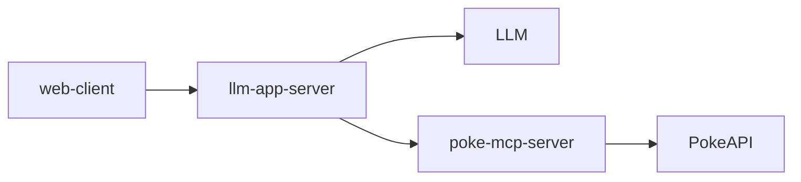

# trial-llm-app

`gh-pages` ブランチの静的アセットを Github Pages で公開する。
バックエンドは CloudRun にデプロイ予定。

## ディレクトリ構成

```text
.
├── .github
├── .vscode
├── web-client       : Webクライアント
├── llm-app-server   : LLM APサーバ
└── poke-mcp-server  : PokeAPI を具備する MCPサーバ
```

## アーキテクチャ



## ローカルでの起動方法

- コンテナ起動

  ```sh
  docker compose up
  ```

- ブラウザでアクセス

  http://localhost:5173/

## インターネットへの公開方法

- 静的アセットデプロイ

  ```sh
  (cd web-client && npm run build)
  (cd web-client && npm run deploy)
  ```

- ブラウザでアクセス

  https://okmethod.github.io/trial-llm-app/
